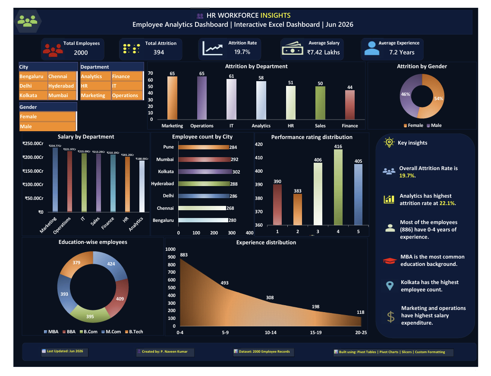

# 📊 HR Workforce Insights — Employee Analytics Dashboard

## 🔍 Project Overview
An interactive HR Analytics Dashboard built in Microsoft Excel, analyzing **2,000 employee records** to uncover workforce trends, attrition patterns, compensation distribution, and performance insights.

---

## 📌 Key Insights
- 📉 Overall attrition rate stands at **19.7%** — nearly 1 in 5 employees left the organization
- 🏢 **Analytics department** recorded the highest attrition among all departments
- 💰 **Marketing & Operations** contributed the highest share of salary expenditure
- 👥 Employees with **0–4 years of experience** form the largest workforce segment
- 🎓 **MBA graduates** represent the most common educational background
- 🏙️ **Kolkata** recorded the highest employee count among all cities
- 🎛️ Interactive slicers enable analysis by **City, Department, and Gender**

---

## 🛠️ Tools & Techniques Used
| Tool | Purpose |
|------|---------|
| Microsoft Excel | Dashboard Development |
| Pivot Tables | Data Summarization |
| Pivot Charts | Data Visualization |
| Slicers | Interactive Filtering |
| Custom Formatting | Professional Design |

---

## 📁 Files in this Repository
| File | Description |
|------|-------------|
| `HR_Analytics_Analysis_Dashboard.xlsx` | Interactive Excel Dashboard |
| `HR_Workforce_Dashboard.pdf` | PDF version of the Dashboard |
| `HR_Dashboard_Preview.png` | Dashboard Screenshot |

---

## 💡 What I Learned
- Transforming raw HR data into meaningful business insights
- Building interactive dashboards using Pivot Tables, Pivot Charts & Slicers
- Analyzing attrition, salary & workforce demographics across multiple dimensions
- Improving data storytelling through effective dashboard design

---

## 👨‍💻 Author
**Panthagada Naveen Kumar**  
MBA Graduate | Business Analytics & Marketing  
📧 Connect with me on [LinkedIn](https://www.linkedin.com/in/panthagada-naveen-kumar/)
